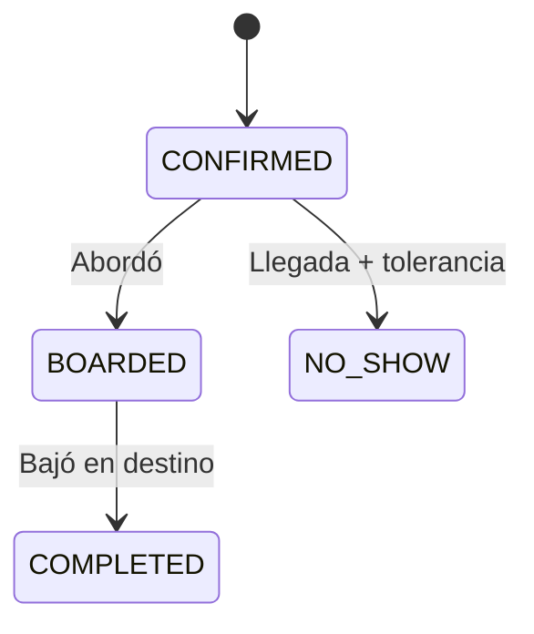
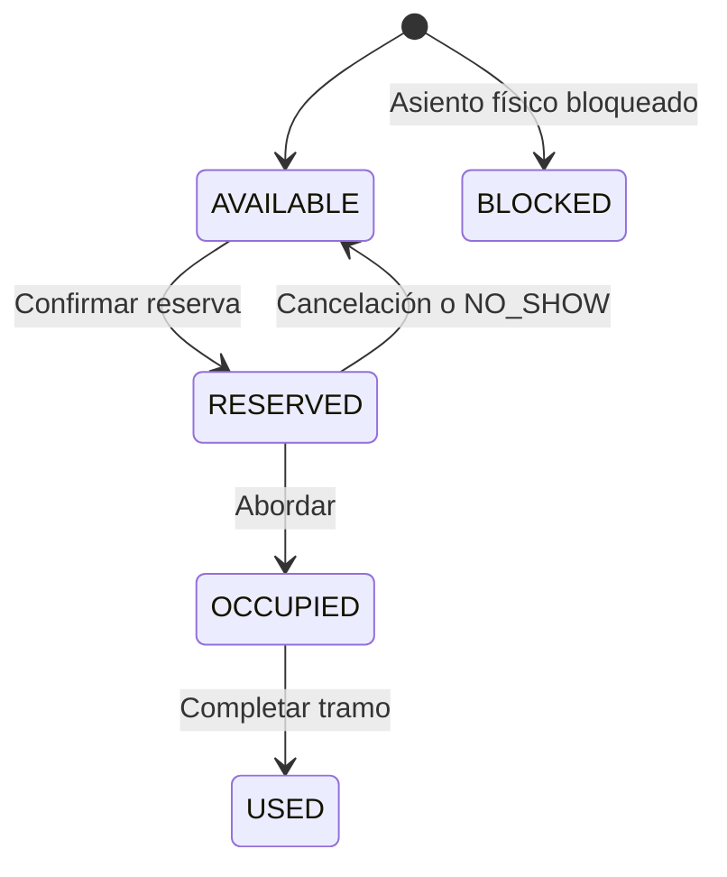

# Diccionario de datos — Transporte corporativo MVP

## 1. Alcance del entregable

Este diseño conserva las funciones vitales del sistema con 22 tablas:

- rutas estrictamente direccionales: `IDA` y `VUELTA`;
- sedes y paraderos intermedios ordenados;
- matriz manual de tiempos por tramo y perfil horario;
- calendarios, excepciones y plantillas para generar viajes futuros;
- horarios calculados automáticamente sin servicio de mapas;
- vehículo, conductor y asientos materializados por viaje;
- disponibilidad y bloqueo de asiento por segmentos exactos;
- reserva concurrente y auditable;
- abordaje, bajada y liberación por `NO_SHOW`;
- incidencias mínimas y detección de solapamientos.

No se incluyen en el MVP: GPS/mapas, correspondencia, calificaciones, historial de notificaciones, mantenimiento vehicular, pagos, aprobaciones, lista de espera ni tablas físicas de reportes. Los reportes iniciales se obtienen de las tablas y vistas existentes.

El archivo SQL objetivo es compatible con MySQL 8.0.16+ y MariaDB 10.6+. Usa nombres en inglés, `snake_case`, sustantivos en plural y sin prefijos como `TBL_`, porque el contexto ya lo aporta el esquema.

## 2. Consecuencia literal de las reglas recibidas

El modelo implementa exactamente estas dos restricciones:

- `IDA`: el destino de la reserva debe ser una `SEDE`.
- `VUELTA`: el origen de la reserva debe ser una `SEDE`.

Por eso, en el ejemplo de VUELTA `Sede A (orden 1) → Paradero 2 (orden 3)`, el asiento queda matemáticamente libre desde el orden 3, pero un trabajador no puede iniciar otra reserva en ese paradero mientras siga vigente la regla estricta de VUELTA. Sólo podrá reutilizarse desde un punto posterior que también sea una `SEDE` y tenga subida habilitada. La frase “otro trabajador en el siguiente paradero” sí es compatible directamente con una ruta de IDA, donde se permite iniciar en un paradero.

Si negocio quiere permitir nuevas subidas en paraderos durante la VUELTA, esa regla debe modificarse expresamente. El esquema soporta el inventario, pero `sp_search_trips` y `sp_confirm_reservation` actualmente lo rechazan para no inventar una excepción.

Tampoco se implementa cancelación voluntaria de una reserva ya confirmada: sería un tercer mecanismo de liberación y contradiría la restricción “sólo orden de bajada o NO_SHOW”. Sí se conserva `CANCELLED` en el viaje completo, porque cancelar una operación no equivale a reasignar el asiento dentro de ese viaje.

## 3. Orden lógico de las tablas

| Orden | Grupo | Tabla | Función |
|---:|---|---|---|
| 1 | Fuerte | `transport_stops` | Catálogo de sedes y paraderos. |
| 2 | Fuerte | `users` | Administradores, conductores y trabajadores. |
| 3 | Fuerte | `vehicles` | Vehículos físicos. |
| 4 | Fuerte | `transport_routes` | Rutas direccionales IDA/VUELTA. |
| 5 | Débil de maestro | `vehicle_seats` | Asientos físicos de cada vehículo. |
| 6 | Débil de maestro | `route_stops` | Secuencia de puntos de una ruta. |
| 7 | Débil de maestro | `route_segments` | Tramos consecutivos de una ruta. |
| 8 | Configuración | `travel_time_profiles` | Condiciones horarias de la matriz. |
| 9 | Configuración | `route_segment_travel_times` | Minutos manuales por tramo/perfil. |
| 10 | Configuración | `service_calendars` | Días regulares de operación. |
| 11 | Débil de calendario | `service_calendar_exceptions` | Fechas agregadas o retiradas. |
| 12 | Configuración | `trip_templates` | Reglas recurrentes de generación. |
| 13 | Intermedia | `trip_generation_runs` | Auditoría de cada corrida del motor. |
| 14 | Intermedia | `trip_instances` | Viaje futuro o real materializado. |
| 15 | Débil de viaje | `trip_stop_times` | Cronograma calculado del viaje. |
| 16 | Débil de viaje | `trip_segments` | Segmentos concretos del viaje. |
| 17 | Débil de viaje | `trip_seats` | Copia de los asientos para el viaje. |
| 18 | Inventario intermedio | `trip_seat_segments` | Estado de cada asiento en cada segmento. |
| 19 | Transaccional | `reservations` | Cabecera de la reserva. |
| 20 | Débil de reserva | `reservation_segments` | Segmentos asignados e historial de liberación. |
| 21 | Débil de reserva | `reservation_events` | Bitácora de cambios de la reserva. |
| 22 | Transaccional | `trip_incidents` | Incidencias operativas del viaje. |

## 4. Convenciones

- `PK`: clave primaria.
- `FK`: clave foránea.
- `UK`: restricción única.
- `NN`: no permite `NULL`.
- Los intervalos de reserva son semiabiertos: `[orden_subida, orden_bajada)`. Una reserva de 1 a 3 ocupa los segmentos 1 y 2, nunca el segmento 3.
- `created_at` registra creación y `updated_at` la última modificación automática cuando ambos existen.
- Las horas operativas deben tratarse con una zona horaria única; el script usa UTC-05:00 para el ejemplo.

## 5. Diccionario de tablas y columnas

### 5.1 `transport_stops`

Catálogo fuerte de puntos ingresados manualmente. No depende de un proveedor de mapas.

| Campo | Tipo | Nulo | Clave | Descripción |
|---|---|:---:|---|---|
| `id` | `BIGINT UNSIGNED` | No | PK | Identificador interno del punto. |
| `code` | `VARCHAR(30)` | No | UK | Código estable usado por integraciones y carga. |
| `name` | `VARCHAR(150)` | No |  | Nombre visible. |
| `stop_type` | `ENUM('SEDE','PARADERO')` | No |  | Clasificación lógica del punto. |
| `reference_text` | `VARCHAR(255)` | Sí |  | Referencia escrita para ubicarlo manualmente. |
| `latitude`, `longitude` | `DECIMAL` | Sí |  | Coordenadas opcionales; no intervienen en el cálculo de tiempos. |
| `active` | `TINYINT(1)` | No |  | Habilita el punto sin borrar su historial. |
| `created_at`, `updated_at` | `DATETIME` | No |  | Auditoría técnica. |

Carga: administración, una vez por sede/paradero y cuando se incorpora un nuevo punto.

### 5.2 `users`

Unifica actores para reducir tablas del MVP. Los campos de licencia sólo aplican al rol `DRIVER`.

| Campo | Tipo | Nulo | Clave | Descripción |
|---|---|:---:|---|---|
| `id` | `BIGINT UNSIGNED` | No | PK | Identificador del usuario. |
| `employee_code` | `VARCHAR(30)` | No | UK | Código interno del empleado. |
| `document_number` | `VARCHAR(20)` | No | UK | Documento utilizado para identificarlo. |
| `password_hash` | `VARCHAR(255)` | No |  | Hash seguro; nunca contraseña en texto plano. |
| `full_name` | `VARCHAR(150)` | No |  | Nombre completo. |
| `role` | `ENUM('ADMIN','DRIVER','WORKER')` | No |  | Rol de acceso. |
| `department` | `VARCHAR(100)` | Sí |  | Área del trabajador. |
| `phone` | `VARCHAR(25)` | Sí |  | Teléfono de contacto. |
| `preferred_stop_id` | `BIGINT UNSIGNED` | Sí | FK | Paradero habitual del trabajador; no limita sus búsquedas. |
| `driver_license_number` | `VARCHAR(50)` | Sí |  | Número de licencia del conductor. |
| `driver_license_category` | `VARCHAR(20)` | Sí |  | Categoría de licencia. |
| `driver_license_expires_on` | `DATE` | Sí |  | Vencimiento de licencia. |
| `fcm_token` | `VARCHAR(255)` | Sí |  | Token del dispositivo actual para MVP. |
| `active` | `TINYINT(1)` | No |  | Estado lógico. |
| `created_at`, `updated_at` | `DATETIME` | No |  | Auditoría técnica. |

Carga: importación desde RR. HH. o mantenimiento administrativo. La autenticación debe reemplazar el hash de demostración.

### 5.3 `vehicles`

| Campo | Tipo | Nulo | Clave | Descripción |
|---|---|:---:|---|---|
| `id` | `BIGINT UNSIGNED` | No | PK | Identificador del vehículo. |
| `internal_code` | `VARCHAR(30)` | No | UK | Código interno. |
| `plate` | `VARCHAR(15)` | No | UK | Placa. |
| `description` | `VARCHAR(120)` | Sí |  | Marca/modelo o descripción operativa. |
| `seat_capacity` | `SMALLINT UNSIGNED` | No |  | Cantidad física esperada de asientos no retirados. |
| `active` | `TINYINT(1)` | No |  | Disponibilidad administrativa. |
| `created_at`, `updated_at` | `DATETIME` | No |  | Auditoría técnica. |

Carga: administración de transporte. Antes de generar viajes, la capacidad debe coincidir con `vehicle_seats` no retirados.

### 5.4 `transport_routes`

Cada fila es una dirección concreta; IDA y VUELTA se emparejan, pero mantienen orden y tiempos independientes.

| Campo | Tipo | Nulo | Clave | Descripción |
|---|---|:---:|---|---|
| `id` | `BIGINT UNSIGNED` | No | PK | Identificador de la ruta direccional. |
| `code` | `VARCHAR(40)` | No | UK | Código estable. |
| `name` | `VARCHAR(150)` | No |  | Nombre visible. |
| `direction` | `ENUM('IDA','VUELTA')` | No |  | Modalidad estricta. |
| `paired_route_id` | `BIGINT UNSIGNED` | Sí | FK | Ruta inversa asociada. |
| `active` | `TINYINT(1)` | No |  | Habilita la ruta. |
| `created_at`, `updated_at` | `DATETIME` | No |  | Auditoría técnica. |

Carga: administración. Primero se crean ambas direcciones y luego se enlazan.

### 5.5 `vehicle_seats`

| Campo | Tipo | Nulo | Clave | Descripción |
|---|---|:---:|---|---|
| `id` | `BIGINT UNSIGNED` | No | PK | Identificador del asiento físico. |
| `vehicle_id` | `BIGINT UNSIGNED` | No | FK | Vehículo propietario. |
| `seat_number` | `SMALLINT UNSIGNED` | No | UK compuesta | Número ordenable del asiento. |
| `seat_label` | `VARCHAR(10)` | No | UK compuesta | Etiqueta visible: `5`, `8A`, etc. |
| `status` | `ENUM('ACTIVE','BLOCKED','RETIRED')` | No |  | Estado físico/administrativo. |
| `block_reason` | `VARCHAR(255)` | Sí |  | Motivo si está bloqueado. |
| `created_at`, `updated_at` | `DATETIME` | No |  | Auditoría técnica. |

Carga: una fila por asiento al registrar el vehículo. El generador copia los no retirados a `trip_seats`.

### 5.6 `route_stops`

| Campo | Tipo | Nulo | Clave | Descripción |
|---|---|:---:|---|---|
| `id` | `BIGINT UNSIGNED` | No | PK | Parada dentro de una ruta. |
| `route_id` | `BIGINT UNSIGNED` | No | FK | Ruta direccional. |
| `stop_id` | `BIGINT UNSIGNED` | No | FK | Sede/paradero físico. |
| `stop_order` | `SMALLINT UNSIGNED` | No | UK compuesta | Posición 1..N sin huecos. |
| `dwell_minutes` | `SMALLINT UNSIGNED` | No |  | Minutos de permanencia antes de salir. |
| `pickup_allowed` | `TINYINT(1)` | No |  | Permite origen de una reserva. |
| `dropoff_allowed` | `TINYINT(1)` | No |  | Permite destino de una reserva. |
| `created_at`, `updated_at` | `DATETIME` | No |  | Auditoría técnica. |

Carga: administración, respetando el sentido de la ruta. Para IDA se habilitan subidas en paraderos y bajada en sedes; para VUELTA, subida en sedes y bajada en paraderos.

### 5.7 `route_segments`

| Campo | Tipo | Nulo | Clave | Descripción |
|---|---|:---:|---|---|
| `id` | `BIGINT UNSIGNED` | No | PK | Identificador del tramo reutilizable. |
| `route_id` | `BIGINT UNSIGNED` | No | FK | Ruta a la que pertenece. |
| `segment_order` | `SMALLINT UNSIGNED` | No | UK compuesta | Igual al orden de la parada inicial. |
| `from_route_stop_id` | `BIGINT UNSIGNED` | No | FK | Parada de inicio. |
| `to_route_stop_id` | `BIGINT UNSIGNED` | No | FK | Siguiente parada consecutiva. |
| `active` | `TINYINT(1)` | No |  | Habilita el tramo. |
| `created_at`, `updated_at` | `DATETIME` | No |  | Auditoría técnica. |

Carga: se crean N−1 tramos después de ordenar N paradas. Dos triggers impiden unir rutas distintas o saltar órdenes.

### 5.8 `travel_time_profiles`

Define cuándo se aplica una versión de tiempos: base, punta de mañana, punta de tarde, temporada, etc.

| Campo | Tipo | Nulo | Clave | Descripción |
|---|---|:---:|---|---|
| `id` | `BIGINT UNSIGNED` | No | PK | Identificador del perfil. |
| `code` | `VARCHAR(40)` | No | UK | Código estable. |
| `name` | `VARCHAR(120)` | No |  | Nombre explicativo. |
| `valid_from`, `valid_until` | `DATE` | Sí |  | Vigencia opcional del perfil. |
| `start_time`, `end_time` | `TIME` | Sí |  | Rango horario; admite cruce de medianoche. |
| `is_all_day` | `TINYINT(1)` | No |  | Ignora el rango horario cuando vale 1. |
| `monday`, `tuesday`, `wednesday`, `thursday`, `friday`, `saturday`, `sunday` | `TINYINT(1)` | No |  | Días en los que aplica. |
| `priority` | `SMALLINT` | No |  | Gana el valor mayor cuando coinciden perfiles. |
| `is_default` | `TINYINT(1)` | No |  | Marca el perfil de respaldo. |
| `active` | `TINYINT(1)` | No |  | Habilita el perfil. |
| `created_at`, `updated_at` | `DATETIME` | No |  | Auditoría técnica. |

Carga: administración. Debe existir por lo menos un perfil base aplicable a todo momento para evitar huecos.

### 5.9 `route_segment_travel_times`

Esta es la matriz manual de tiempos, normalizada por tramos consecutivos.

| Campo | Tipo | Nulo | Clave | Descripción |
|---|---|:---:|---|---|
| `id` | `BIGINT UNSIGNED` | No | PK | Identificador de la celda de matriz. |
| `route_segment_id` | `BIGINT UNSIGNED` | No | FK, UK compuesta | Tramo. |
| `profile_id` | `BIGINT UNSIGNED` | No | FK, UK compuesta | Perfil horario. |
| `travel_minutes` | `SMALLINT UNSIGNED` | No |  | Minutos manuales desde la parada inicial a la siguiente. |
| `notes` | `VARCHAR(255)` | Sí |  | Fuente o comentario de calibración. |
| `created_at`, `updated_at` | `DATETIME` | No |  | Auditoría técnica. |

Carga: administración. Para cada tramo se registra un valor base y, opcionalmente, valores de mayor prioridad. No se guarda una matriz origen-destino completa porque los tiempos se suman tramo a tramo.

### 5.10 `service_calendars`

| Campo | Tipo | Nulo | Clave | Descripción |
|---|---|:---:|---|---|
| `id` | `BIGINT UNSIGNED` | No | PK | Identificador del calendario. |
| `code` | `VARCHAR(40)` | No | UK | Código estable. |
| `name` | `VARCHAR(120)` | No |  | Nombre. |
| `valid_from`, `valid_until` | `DATE` | No |  | Rango general de operación. |
| `monday`, `tuesday`, `wednesday`, `thursday`, `friday`, `saturday`, `sunday` | `TINYINT(1)` | No |  | Patrón semanal. |
| `active` | `TINYINT(1)` | No |  | Habilita el calendario. |
| `created_at`, `updated_at` | `DATETIME` | No |  | Auditoría técnica. |

Carga: administración al inicio de cada periodo operativo.

### 5.11 `service_calendar_exceptions`

| Campo | Tipo | Nulo | Clave | Descripción |
|---|---|:---:|---|---|
| `id` | `BIGINT UNSIGNED` | No | PK | Identificador. |
| `calendar_id` | `BIGINT UNSIGNED` | No | FK, UK compuesta | Calendario afectado. |
| `exception_date` | `DATE` | No | UK compuesta | Fecha excepcional. |
| `operation` | `ENUM('ADD','REMOVE')` | No |  | `ADD` habilita; `REMOVE` elimina el servicio. |
| `reason` | `VARCHAR(255)` | Sí |  | Motivo auditable. |
| `created_at`, `updated_at` | `DATETIME` | No |  | Auditoría técnica. |

Carga: administración antes de generar o regenerar el horizonte afectado.

### 5.12 `trip_templates`

Plantilla recurrente: ruta + calendario + hora + recursos + política mínima de reserva.

| Campo | Tipo | Nulo | Clave | Descripción |
|---|---|:---:|---|---|
| `id` | `BIGINT UNSIGNED` | No | PK | Identificador. |
| `code` | `VARCHAR(50)` | No | UK | Código usado para construir el código del viaje. |
| `name` | `VARCHAR(150)` | No |  | Nombre visible. |
| `route_id` | `BIGINT UNSIGNED` | No | FK | Ruta direccional. |
| `service_calendar_id` | `BIGINT UNSIGNED` | No | FK | Calendario aplicable. |
| `departure_time` | `TIME` | No |  | Hora de salida de la primera parada. |
| `default_vehicle_id` | `BIGINT UNSIGNED` | No | FK | Vehículo usado al generar. |
| `default_driver_id` | `BIGINT UNSIGNED` | No | FK | Conductor usado al generar. |
| `profile_reference_mode` | `ENUM` | No |  | Evalúa el perfil a la salida del viaje o de cada segmento. |
| `booking_open_days_before` | `SMALLINT UNSIGNED` | No |  | Anticipación de apertura. |
| `booking_close_minutes_before` | `SMALLINT UNSIGNED` | No |  | Cierre antes de la salida. |
| `no_show_tolerance_minutes` | `SMALLINT UNSIGNED` | No |  | Tolerancia copiada al viaje. |
| `automatic_publish` | `TINYINT(1)` | No |  | Publica automáticamente el viaje generado. |
| `active` | `TINYINT(1)` | No |  | Habilita la plantilla. |
| `created_at`, `updated_at` | `DATETIME` | No |  | Auditoría técnica. |

Carga: administración. Una plantilla representa una salida recurrente, por ejemplo “Ruta Norte VUELTA 18:00”.

### 5.13 `trip_generation_runs`

| Campo | Tipo | Nulo | Clave | Descripción |
|---|---|:---:|---|---|
| `id` | `BIGINT UNSIGNED` | No | PK | Identificador de la corrida. |
| `window_start`, `window_end` | `DATE` | No |  | Horizonte solicitado. |
| `status` | `ENUM` | No |  | `RUNNING`, `COMPLETED`, `COMPLETED_WITH_ERRORS` o `FAILED`. |
| `generated_count` | `INT UNSIGNED` | No |  | Viajes creados. |
| `skipped_count` | `INT UNSIGNED` | No |  | Fechas sin servicio o viajes ya existentes. |
| `failed_count` | `INT UNSIGNED` | No |  | Intentos con configuración inválida. |
| `error_summary` | `TEXT` | Sí |  | Resumen de errores por plantilla/fecha. |
| `triggered_by_user_id` | `BIGINT UNSIGNED` | Sí | FK | Usuario que inició la corrida; nulo para tarea del sistema. |
| `started_at`, `finished_at` | `DATETIME` | Mixto |  | Inicio y fin de la corrida. |

Carga: el job del generador crea una fila al empezar y la cierra al terminar.

### 5.14 `trip_instances`

Es la materialización reservable. Los cambios posteriores en ruta, matriz o vehículo no reescriben automáticamente su cronograma.

| Campo | Tipo | Nulo | Clave | Descripción |
|---|---|:---:|---|---|
| `id` | `BIGINT UNSIGNED` | No | PK | Identificador del viaje. |
| `trip_code` | `VARCHAR(60)` | No | UK | Código visible/estable. |
| `source` | `ENUM('GENERATED','MANUAL')` | No |  | Origen del viaje. |
| `trip_template_id` | `BIGINT UNSIGNED` | Sí | FK, UK compuesta | Plantilla de origen; puede ser nula en viaje manual. |
| `generation_run_id` | `BIGINT UNSIGNED` | Sí | FK | Corrida que lo produjo. |
| `route_id` | `BIGINT UNSIGNED` | No | FK | Ruta direccional. |
| `service_date` | `DATE` | No | UK compuesta | Fecha operativa. |
| `scheduled_start_at`, `scheduled_end_at` | `DATETIME` | No |  | Inicio y fin calculados. |
| `booking_opens_at`, `booking_closes_at` | `DATETIME` | No |  | Ventana de reserva. |
| `vehicle_id` | `BIGINT UNSIGNED` | No | FK | Vehículo asignado. |
| `driver_id` | `BIGINT UNSIGNED` | No | FK | Conductor asignado. |
| `seat_capacity_snapshot` | `SMALLINT UNSIGNED` | No |  | Asientos activos al generar. |
| `no_show_tolerance_minutes` | `SMALLINT UNSIGNED` | No |  | Copia de la tolerancia aplicable. |
| `status` | `ENUM` | No |  | `DRAFT`, `PUBLISHED`, `BOARDING`, `IN_PROGRESS`, `COMPLETED` o `CANCELLED`. |
| `actual_start_at`, `actual_end_at` | `DATETIME` | Sí |  | Ejecución real. |
| `cancellation_reason` | `VARCHAR(255)` | Sí |  | Motivo de cancelación del viaje. |
| `created_at`, `updated_at` | `DATETIME` | No |  | Auditoría técnica. |

Carga: automática mediante `sp_generate_trip_instance`, o manual para una excepción operativa. La combinación plantilla/fecha es única, haciendo idempotente el generador.

### 5.15 `trip_stop_times`

| Campo | Tipo | Nulo | Clave | Descripción |
|---|---|:---:|---|---|
| `id` | `BIGINT UNSIGNED` | No | PK | Parada concreta del viaje. |
| `trip_id` | `BIGINT UNSIGNED` | No | FK, UK compuesta | Viaje. |
| `route_stop_id` | `BIGINT UNSIGNED` | No | FK | Configuración de origen. |
| `stop_id` | `BIGINT UNSIGNED` | No | FK | Punto físico. |
| `stop_order` | `SMALLINT UNSIGNED` | No | UK compuesta | Orden copiado. |
| `scheduled_arrival_at` | `DATETIME` | No |  | Llegada calculada. |
| `scheduled_departure_at` | `DATETIME` | No |  | Salida calculada después de permanencia. |
| `applied_profile_id` | `BIGINT UNSIGNED` | Sí | FK | Perfil seleccionado para llegar desde el tramo anterior. |
| `applied_travel_minutes` | `SMALLINT UNSIGNED` | No |  | Minutos utilizados; 0 en la primera parada. |
| `applied_dwell_minutes` | `SMALLINT UNSIGNED` | No |  | Permanencia utilizada. |
| `actual_arrival_at`, `actual_departure_at` | `DATETIME` | Sí |  | Tiempos reales. |
| `arrival_marked_by_user_id` | `BIGINT UNSIGNED` | Sí | FK | Conductor que marcó llegada. |
| `status` | `ENUM` | No |  | `PENDING`, `ARRIVED`, `DEPARTED` o `SKIPPED`. |
| `created_at`, `updated_at` | `DATETIME` | No |  | Auditoría técnica. |

Carga: el generador suma viaje + permanencia + tiempo manual de cada tramo. Durante operación, el conductor completa los tiempos reales.

### 5.16 `trip_segments`

| Campo | Tipo | Nulo | Clave | Descripción |
|---|---|:---:|---|---|
| `id` | `BIGINT UNSIGNED` | No | PK | Segmento concreto. |
| `trip_id` | `BIGINT UNSIGNED` | No | FK, UK compuesta | Viaje. |
| `segment_order` | `SMALLINT UNSIGNED` | No | UK compuesta | Orden igual a la parada inicial. |
| `from_trip_stop_time_id` | `BIGINT UNSIGNED` | No | FK | Inicio concreto. |
| `to_trip_stop_time_id` | `BIGINT UNSIGNED` | No | FK | Fin concreto. |
| `created_at` | `DATETIME` | No |  | Auditoría de creación. |

Carga: automática. Para N paradas del viaje se crean N−1 segmentos.

### 5.17 `trip_seats`

| Campo | Tipo | Nulo | Clave | Descripción |
|---|---|:---:|---|---|
| `id` | `BIGINT UNSIGNED` | No | PK | Asiento concreto del viaje. |
| `trip_id` | `BIGINT UNSIGNED` | No | FK, UK compuesta | Viaje. |
| `vehicle_seat_id` | `BIGINT UNSIGNED` | No | FK | Asiento físico de origen. |
| `seat_number` | `SMALLINT UNSIGNED` | No | UK compuesta | Número copiado. |
| `seat_label` | `VARCHAR(10)` | No | UK compuesta | Etiqueta copiada. |
| `is_blocked` | `TINYINT(1)` | No |  | Impide ofrecerlo en ese viaje. |
| `block_reason` | `VARCHAR(255)` | Sí |  | Motivo copiado. |
| `created_at` | `DATETIME` | No |  | Auditoría de creación. |

Carga: automática desde `vehicle_seats` al generar. Conserva el mapa del viaje aunque después cambie el vehículo maestro.

### 5.18 `trip_seat_segments`

Inventario vivo y unidad de bloqueo. Es vital: no debe reemplazarse por un único campo de “asientos disponibles” en el viaje.

| Campo | Tipo | Nulo | Clave | Descripción |
|---|---|:---:|---|---|
| `id` | `BIGINT UNSIGNED` | No | PK | Celda del inventario. |
| `trip_seat_id` | `BIGINT UNSIGNED` | No | FK, UK compuesta | Asiento concreto. |
| `trip_segment_id` | `BIGINT UNSIGNED` | No | FK, UK compuesta | Segmento concreto. |
| `state` | `ENUM` | No |  | `AVAILABLE`, `RESERVED`, `OCCUPIED`, `USED` o `BLOCKED`. |
| `reservation_id` | `BIGINT UNSIGNED` | Sí | FK | Reserva activa/histórica que ocupa la celda. |
| `reserved_at` | `DATETIME` | Sí |  | Momento del bloqueo. |
| `released_at` | `DATETIME` | Sí |  | Momento de liberación por NO_SHOW. |
| `created_at`, `updated_at` | `DATETIME` | No |  | Auditoría técnica. |

Carga: automática mediante producto cartesiano `trip_seats × trip_segments`. La reserva bloquea dentro de una transacción sólo las filas solicitadas.

### 5.19 `reservations`

| Campo | Tipo | Nulo | Clave | Descripción |
|---|---|:---:|---|---|
| `id` | `BIGINT UNSIGNED` | No | PK | Identificador. |
| `reservation_code` | `VARCHAR(32)` | No | UK | Código visible. |
| `qr_token_hash` | `CHAR(64)` | No | UK | Hash SHA-256 del token; el token QR sólo se devuelve una vez al confirmar. |
| `booking_group_uuid` | `CHAR(36)` | Sí |  | Agrupador opcional que la aplicación envía igual en las reservas de IDA/VUELTA. |
| `trip_id` | `BIGINT UNSIGNED` | No | FK | Viaje reservado. |
| `worker_id` | `BIGINT UNSIGNED` | No | FK | Trabajador. |
| `trip_seat_id` | `BIGINT UNSIGNED` | No | FK | Asiento elegido. |
| `origin_trip_stop_time_id` | `BIGINT UNSIGNED` | No | FK | Punto concreto de subida. |
| `destination_trip_stop_time_id` | `BIGINT UNSIGNED` | No | FK | Punto concreto de bajada. |
| `origin_stop_order` | `SMALLINT UNSIGNED` | No |  | Copia del orden inicial. |
| `destination_stop_order` | `SMALLINT UNSIGNED` | No |  | Copia del orden final. |
| `status` | `ENUM` | No |  | `CONFIRMED`, `BOARDED`, `COMPLETED` o `NO_SHOW`. |
| `created_by_user_id` | `BIGINT UNSIGNED` | No | FK | Actor que creó la reserva. |
| `confirmed_at` | `DATETIME` | No |  | Confirmación. |
| `boarded_at`, `completed_at` | `DATETIME` | Sí |  | Abordaje y término. |
| `no_show_at` | `DATETIME` | Sí |  | Declaración de ausencia. |
| `no_show_by_user_id` | `BIGINT UNSIGNED` | Sí | FK | Conductor que declaró ausencia. |
| `no_show_trip_stop_time_id` | `BIGINT UNSIGNED` | Sí | FK | Punto físico en que se declaró. |
| `created_at`, `updated_at` | `DATETIME` | No |  | Auditoría técnica. |

Carga: exclusivamente por operaciones transaccionales; el procedimiento de confirmación valida reglas, ventana y disponibilidad antes de insertar.

### 5.20 `reservation_segments`

Historial que no se borra cuando las celdas de inventario vuelven a `AVAILABLE`.

| Campo | Tipo | Nulo | Clave | Descripción |
|---|---|:---:|---|---|
| `id` | `BIGINT UNSIGNED` | No | PK | Identificador. |
| `reservation_id` | `BIGINT UNSIGNED` | No | FK, UK compuesta | Reserva. |
| `trip_segment_id` | `BIGINT UNSIGNED` | No | FK, UK compuesta | Segmento originalmente asignado. |
| `allocation_status` | `ENUM` | No |  | `RESERVED`, `OCCUPIED`, `USED` o `RELEASED`. |
| `reserved_at` | `DATETIME` | No |  | Momento de asignación. |
| `released_at` | `DATETIME` | Sí |  | Momento de liberación. |
| `created_at`, `updated_at` | `DATETIME` | No |  | Auditoría técnica. |

Carga: automática al confirmar; luego cambia de estado, pero no se elimina.

### 5.21 `reservation_events`

| Campo | Tipo | Nulo | Clave | Descripción |
|---|---|:---:|---|---|
| `id` | `BIGINT UNSIGNED` | No | PK | Identificador del evento. |
| `reservation_id` | `BIGINT UNSIGNED` | No | FK | Reserva. |
| `event_type` | `ENUM` | No |  | `CONFIRMED`, `BOARDED`, `ALIGHTED`, `NO_SHOW` o `SEGMENTS_RELEASED`. |
| `trip_stop_time_id` | `BIGINT UNSIGNED` | Sí | FK | Parada relacionada. |
| `actor_user_id` | `BIGINT UNSIGNED` | No | FK | Usuario responsable. |
| `event_at` | `DATETIME` | No |  | Fecha y hora del evento. |
| `details` | `VARCHAR(500)` | Sí |  | Explicación legible. |

Carga: automática en cada transición de la reserva.

### 5.22 `trip_incidents`

| Campo | Tipo | Nulo | Clave | Descripción |
|---|---|:---:|---|---|
| `id` | `BIGINT UNSIGNED` | No | PK | Identificador. |
| `trip_id` | `BIGINT UNSIGNED` | No | FK | Viaje afectado. |
| `reported_by_user_id` | `BIGINT UNSIGNED` | No | FK | Reportante. |
| `incident_type` | `ENUM` | No |  | `BREAKDOWN`, `DELAY`, `ACCIDENT` u `OTHER`. |
| `description` | `VARCHAR(1000)` | No |  | Descripción. |
| `status` | `ENUM` | No |  | `OPEN`, `IN_REVIEW` o `RESOLVED`. |
| `reported_at` | `DATETIME` | No |  | Registro. |
| `resolved_at` | `DATETIME` | Sí |  | Resolución. |
| `resolution_notes` | `VARCHAR(1000)` | Sí |  | Acción tomada. |

Carga: conductor o administrador durante/después del viaje.

## 6. Cómo se llena la información

### 6.1 Configuración manual inicial

1. Crear `transport_stops`.
2. Crear `users`.
3. Crear `vehicles` y exactamente un `vehicle_seats` por asiento físico.
4. Crear por separado las filas `transport_routes` de IDA y VUELTA y emparejarlas.
5. Ordenar cada dirección en `route_stops` y definir dónde se permite subir/bajar.
6. Crear N−1 `route_segments` por cada N paradas.
7. Crear perfiles en `travel_time_profiles`.
8. Ingresar manualmente los minutos de cada tramo/perfil en `route_segment_travel_times`.
9. Crear `service_calendars` y sus excepciones.
10. Crear una `trip_templates` por salida recurrente.

### 6.2 Generación automática futura

Un job diario puede usar un horizonte móvil de 30 días:

1. Inserta una fila `trip_generation_runs`.
2. Recorre cada plantilla activa y cada fecha del horizonte.
3. `fn_service_operates` aplica calendario y excepción.
4. `sp_generate_trip_instance` evita duplicados por plantilla/fecha.
5. Para cada tramo, `fn_select_travel_time_profile` elige el perfil por fecha/hora/prioridad.
6. Suma minutos de viaje y permanencia para poblar `trip_stop_times`.
7. Genera `trip_segments`, `trip_seats` y `trip_seat_segments`.
8. Rechaza solapamientos del mismo vehículo o conductor.
9. Publica o deja el viaje en borrador según la plantilla.
10. Finaliza la corrida con contadores y errores.

Cambiar la matriz afecta a viajes que se generen después. Para cambiar un viaje ya publicado debe existir una acción explícita de recalcular/reemplazar, porque modificar silenciosamente un horario con reservas sería riesgoso.

### 6.3 Buscador y reserva

1. `sp_search_trips` encuentra viajes que contienen el origen y destino en el orden correcto.
2. Valida dirección, tipo de punto y permisos de subida/bajada.
3. Para cada asiento consulta todas las celdas del intervalo solicitado.
4. Un asiento es disponible sólo si todas están en `AVAILABLE`.
5. `sp_confirm_reservation` bloquea las celdas con una transacción InnoDB.
6. Si otra transacción intenta tomar una celda coincidente, espera y luego recibe conflicto.
7. Inserta cabecera, historial de segmentos y evento `CONFIRMED`.

Fórmula del bloqueo para origen `o` y destino `d`:

```text
segment_order >= o AND segment_order < d
```

### 6.4 Operación y NO_SHOW

1. El conductor ejecuta `sp_mark_trip_stop_arrival`; esto registra la llegada física.
2. Si el trabajador aborda, ejecuta `sp_mark_reservation_boarded`.
3. Si no aborda, sólo después de `actual_arrival_at + tolerancia` se permite `sp_mark_reservation_no_show`.
4. El NO_SHOW cambia la reserva, conserva `reservation_segments`, libera las celdas vivas y registra dos eventos.
5. Al llegar al destino, `sp_mark_reservation_alighted` cierra la reserva. Los segmentos posteriores ya estaban libres por definición matemática.

Las marcas de llegada, abordaje, NO_SHOW y bajada usan `CURRENT_TIMESTAMP` del servidor; el cliente no envía la hora y por eso no puede adelantar artificialmente la tolerancia.

## 7. Estados principales

### Reserva



### Celda asiento-segmento



## 8. Funciones, procedimientos, triggers y vistas

| Objeto | Tipo | Responsabilidad |
|---|---|---|
| `fn_service_operates` | Función | Resuelve patrón semanal + excepción. |
| `fn_select_travel_time_profile` | Función | Elige perfil por vigencia, día, hora y prioridad. |
| `sp_generate_trip_instance` | Procedimiento | Genera un viaje completo para plantilla/fecha. |
| `sp_search_trips` | Procedimiento | Alimenta el buscador y calcula disponibilidad por intervalo. |
| `sp_list_trip_seats` | Procedimiento | Lista disponibilidad de cada asiento para un tramo solicitado. |
| `sp_confirm_reservation` | Procedimiento | Valida y bloquea segmentos atómicamente. |
| `sp_mark_trip_stop_arrival` | Procedimiento | Registra llegada física del conductor. |
| `sp_mark_reservation_boarded` | Procedimiento | Marca abordaje y ocupación. |
| `sp_mark_reservation_no_show` | Procedimiento | Aplica tolerancia y libera por ausencia. |
| `sp_mark_reservation_alighted` | Procedimiento | Finaliza la reserva al bajar. |
| `trg_route_stops_protect_structure` | Trigger | Impide reordenar una ruta que ya tiene matriz; exige versionarla. |
| `trg_route_segments_validate_insert/update` | Trigger | Exige segmentos consecutivos de la misma ruta. |
| `vw_route_time_matrix` | Vista | Presenta la matriz manual en forma legible. |
| `vw_trip_segment_seat_availability` | Vista | Muestra asiento libre/ocupado segmento por segmento. |
| `vw_schedule_conflicts` | Vista | Detecta solapamientos de conductor o vehículo. |

## 9. Registros de demostración incluidos

El script calcula una fecha laborable futura y carga/genera lo siguiente:

| Tabla | Filas esperadas | Ejemplo |
|---|---:|---|
| `transport_stops` | 4 | Sede A y Paraderos 1–3. |
| `users` | 5 | 1 admin, 1 conductor y 3 trabajadores. |
| `vehicles` | 1 | Bus de 12 asientos. |
| `transport_routes` | 2 | Ruta Norte IDA y VUELTA. |
| `vehicle_seats` | 12 | Asientos 1–12. |
| `route_stops` | 8 | 4 por cada dirección. |
| `route_segments` | 6 | 3 por dirección. |
| `travel_time_profiles` | 3 | Base, punta mañana y punta tarde. |
| `route_segment_travel_times` | 18 | 6 tramos × 3 perfiles. |
| `service_calendars` | 1 | Lunes a viernes. |
| `service_calendar_exceptions` | 1 | Fecha retirada de demostración. |
| `trip_templates` | 2 | IDA 08:00 y VUELTA 18:00. |
| `trip_generation_runs` | 1 | Corrida de la fecha futura. |
| `trip_instances` | 2 | Un viaje por dirección. |
| `trip_stop_times` | 8 | 4 por viaje. |
| `trip_segments` | 6 | 3 por viaje. |
| `trip_seats` | 24 | 12 por viaje. |
| `trip_seat_segments` | 72 | 12 × 3 × 2 viajes. |
| `reservations` | 2 | Una de IDA y una de VUELTA para el mismo trabajador/grupo. |
| `reservation_segments` | 4 | Dos segmentos por reserva. |
| `reservation_events` | 2 | Confirmación de cada reserva. |
| `trip_incidents` | 1 | Incidencia cerrada de demostración. |

Caso de control incluido:

- VUELTA, asiento 5, `Sede A (orden 1) → Paradero 2 (orden 3)`.
- Segmentos 1 y 2: `RESERVED`.
- Segmento 3, `Paradero 2 → Paradero 3`: `AVAILABLE`.

## 10. Ejecución y comprobación

El script recrea las tablas del esquema `transporte_corporativo_mvp`; debe ejecutarse primero en un ambiente vacío/de desarrollo.

```bash
mysql --default-character-set=utf8mb4 -u USUARIO -p < transporte_corporativo_mvp.sql
```

Al final devuelve:

- conteo de filas de las 22 tablas;
- estado por segmento del asiento 5 de VUELTA;
- conflictos de agenda, que deben ser cero;
- resultado del buscador `Sede A → Paradero 2`.

Antes de producción se deben reemplazar usuarios, hash de demostración, placa, calendario, matriz de tiempos y fecha excepcional por datos reales.

## 11. Decisiones de negocio aún no definidas

El esquema no inventa respuesta para estos puntos:

1. **Cantidad de reservas por trabajador en un mismo viaje.** No se indicó si un trabajador sólo puede reservar un asiento o puede reservar más de uno. Por eso no existe todavía una restricción única `(trip_id, worker_id)`.
2. **Reserva IDA/VUELTA todo-o-nada.** `booking_group_uuid` permite relacionarlas, pero cada dirección se confirma con disponibilidad propia. No se indicó que ambas deban fallar o confirmarse atómicamente como paquete.
3. **Reutilización en paraderos durante VUELTA.** La disponibilidad matemática existe, pero la regla estricta impide una nueva subida fuera de una sede. Este punto debe resolverse si se espera vender/reasignar el tramo desde el siguiente paradero.
